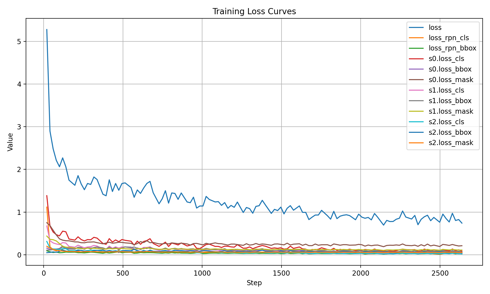
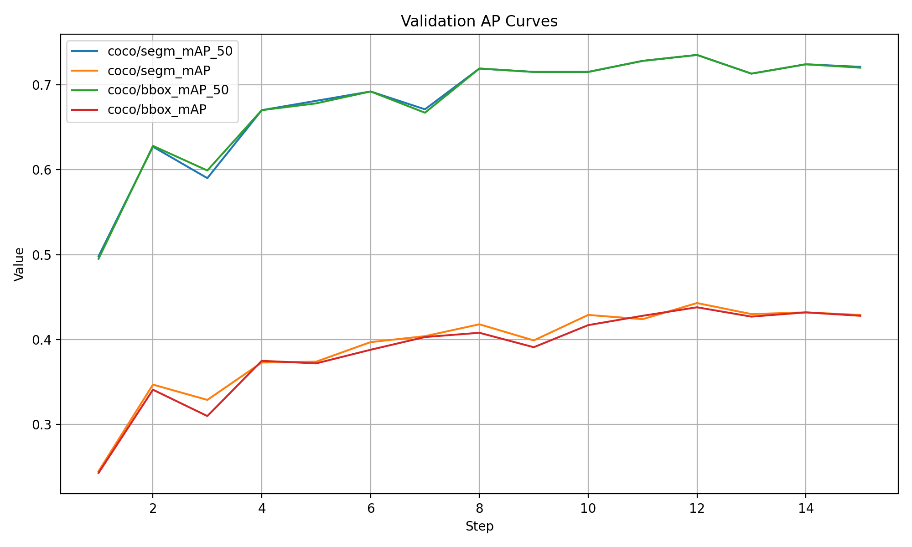
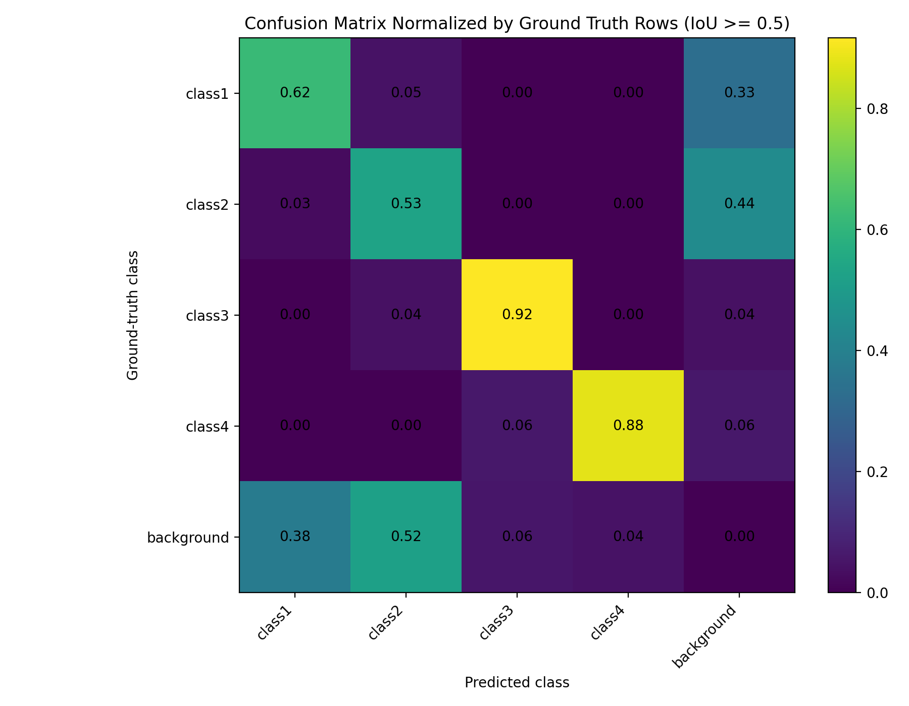
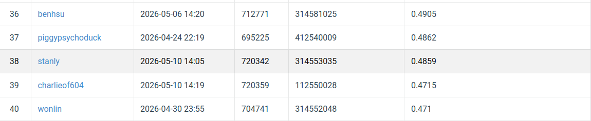

# NYCU Computer Vision 2026 - Homework 3
# Cell Instance Segmentation with Cascade Mask R-CNN

Name: 鄭琮祐  
Student ID: 314553035  
GitHub Repository: https://github.com/stanlybaa/NYCU-Computer-Vision-2026-HW3

---

## 1. Introduction

The objective of this assignment is to build a robust **instance segmentation** pipeline for microscopy cell images.  
For each test image, the model must predict:

- instance mask
- bounding box
- category ID
- confidence score

The final submission is a COCO-style JSON file containing RLE-encoded segmentation masks.

In the early stage of this project, I experimented with `torchvision` Mask R-CNN using `maskrcnn_resnet50_fpn_v2` and COCO-pretrained weights. Although the baseline achieved reasonable results, its performance became unstable and saturated after several rounds of tuning. Therefore, the final implementation adopts **Cascade Mask R-CNN with a ResNet-50-FPN backbone** using MMDetection.

Cascade Mask R-CNN is a natural extension of Mask R-CNN. Instead of using a single RoI box head, Cascade Mask R-CNN refines proposals through multiple detection stages trained with progressively increasing IoU thresholds. This design improves localization quality and is suitable for dense cell instance segmentation, where adjacent instances and duplicate predictions can strongly affect AP.

---

## 2. Repository Structure

```text
NYCU-Computer-Vision-2026-HW3/
├── README.md
├── requirements.txt
├── .gitignore
├── convert_to_coco.py
├── cascade_mask_rcnn_cell.py
├── train.py
├── inference.py
├── plot_mmdet_curves.py
├── plot_confusion_matrix_mmdet.py
└── figures/
    ├── training_loss_curves.png
    ├── validation_ap_curves.png
    ├── confusion_matrix_normalized.png
    └── leaderboard.png
```

### File Descriptions

| File | Description |
|---|---|
| `convert_to_coco.py` | Converts the original TIFF-based dataset into COCO instance segmentation format |
| `cascade_mask_rcnn_cell.py` | MMDetection configuration file for Cascade Mask R-CNN |
| `train.py` | Training script using MMEngine Runner |
| `inference.py` | Inference script that generates `test-results.json` and `submission.zip` |
| `plot_mmdet_curves.py` | Plots training loss and validation AP curves |
| `plot_confusion_matrix_mmdet.py` | Generates instance-level confusion matrix |
| `figures/` | Stores training curves, confusion matrix, and leaderboard screenshot |

---

## 3. Dataset Preprocessing

The original dataset structure is:

```text
train/
├── <image_folder_1>/
│   ├── image.tif
│   ├── class1.tif
│   ├── class2.tif
│   ├── class3.tif
│   └── class4.tif
├── <image_folder_2>/
│   └── ...
```

Each `class*.tif` file is an instance mask.  
Different non-zero pixel values represent different object instances of the same class.

The preprocessing script `convert_to_coco.py` performs the following steps:

1. Read the original TIFF image.
2. Convert grayscale or multi-channel TIFF images into 3-channel images.
3. Apply percentile normalization using the 1st and 99th percentiles.
4. Convert normalized images to 8-bit PNG.
5. Extract each connected instance from `class1.tif` to `class4.tif`.
6. Encode each binary instance mask into COCO RLE format.
7. Generate COCO annotation files for training and validation.

The converted dataset is stored as:

```text
coco_cell/
├── images/
│   ├── train/
│   ├── val/
│   └── test/
└── annotations/
    ├── train.json
    └── val.json
```

---

## 4. Method

### 4.1 Baseline: Mask R-CNN

The initial baseline used `torchvision.models.detection.maskrcnn_resnet50_fpn_v2` with COCO-pretrained weights.  
This baseline used a ResNet-50-FPN backbone, RPN, RoI heads, and a mask prediction branch.

Although this baseline performed better after adaptive inference and TTA, the validation and public leaderboard performance saturated. The best public score from the Mask R-CNN baseline was around `0.3217`.

### 4.2 Final Model: Cascade Mask R-CNN

The final model is **Cascade Mask R-CNN R50-FPN** implemented with MMDetection.

Cascade Mask R-CNN improves the original Mask R-CNN architecture by using a sequence of bounding-box heads.  
Each stage is trained with a higher IoU threshold:

| Stage | IoU Threshold |
|---|---|
| Stage 1 | 0.5 |
| Stage 2 | 0.6 |
| Stage 3 | 0.7 |

The main motivation is that a single-stage RoI head may not produce sufficiently accurate localization for dense cell images. By progressively refining proposals, Cascade Mask R-CNN can produce higher-quality boxes and masks.

### 4.3 Model Components

The final model contains:

- ResNet-50 backbone
- Feature Pyramid Network
- Region Proposal Network
- 3-stage Cascade RoI bbox heads
- FCN mask head

The model is initialized from COCO-pretrained Cascade Mask R-CNN weights and fine-tuned only on the provided HW3 training data.

---

## 5. Hyperparameters

This section is included to make the experiment fully reproducible.

### 5.1 Dataset Split

| Hyperparameter | Value |
|---|---|
| Train / validation split | 0.85 / 0.15 |
| Training images | 177 |
| Validation images | 32 |
| Random seed | 42 |
| Test images | 101 |

### 5.2 Preprocessing Hyperparameters

| Hyperparameter | Value |
|---|---|
| Input image format | TIFF |
| Converted format | PNG |
| Normalization | 1st–99th percentile clipping |
| Mask encoding | COCO RLE |
| Minimum mask area | 6 pixels |

### 5.3 Model Hyperparameters

| Hyperparameter | Value |
|---|---|
| Framework | MMDetection 3.3.0 |
| Architecture | Cascade Mask R-CNN |
| Backbone | ResNet-50 |
| Neck | FPN |
| Pretrained weights | COCO-pretrained Cascade Mask R-CNN |
| Number of classes | 4 |
| Cascade stages | 3 |
| Stage IoU thresholds | 0.5 / 0.6 / 0.7 |
| Mask head | FCNMaskHead |
| RPN NMS IoU | 0.7 |
| RCNN NMS IoU | 0.5 |
| Max predictions per image | 300 |
| Mask threshold | 0.5 |

### 5.4 Training Hyperparameters

| Hyperparameter | Value |
|---|---|
| Epochs | 15 |
| Batch size | 1 |
| Optimizer | AdamW |
| Learning rate | 1e-4 |
| Betas | (0.9, 0.999) |
| Weight decay | 1e-4 |
| Mixed precision | AMP enabled |
| Gradient clipping | max norm = 5.0 |
| Validation interval | 1 epoch |
| Best checkpoint metric | `coco/segm_mAP_50` |
| Checkpoint saving | save best validation checkpoint |

### 5.5 Learning Rate Schedule

| Scheduler | Setting |
|---|---|
| Warmup scheduler | LinearLR |
| Warmup start factor | 0.1 |
| Warmup duration | 500 iterations |
| Main scheduler | CosineAnnealingLR |
| Minimum LR | 1e-6 |

### 5.6 Data Augmentation

| Augmentation | Setting |
|---|---|
| Resize | 1024 × 1024 |
| Keep aspect ratio | Yes |
| Horizontal flip | probability = 0.5 |
| Vertical flip | probability = 0.5 |

### 5.7 Inference Hyperparameters

| Hyperparameter | Value |
|---|---|
| Score threshold | 0.02 |
| Mask threshold | 0.5 |
| Max predictions per image | 300 |
| Output format | COCO-style JSON |
| Mask encoding | RLE |

---

## 6. Environment Setup

MMDetection and MMCV are sensitive to Python, PyTorch, CUDA, and NumPy versions.  
The following setup was used in Google Colab.

### 6.1 Install Miniconda

```bash
wget -q https://repo.anaconda.com/miniconda/Miniconda3-latest-Linux-x86_64.sh -O miniconda.sh
bash miniconda.sh -b -p /content/conda
```

### 6.2 Accept Conda Terms of Service

```bash
/content/conda/bin/conda tos accept --override-channels --channel https://repo.anaconda.com/pkgs/main
/content/conda/bin/conda tos accept --override-channels --channel https://repo.anaconda.com/pkgs/r
```

### 6.3 Create Environment

```bash
/content/conda/bin/conda create -n mmdet python=3.10 -y
```

### 6.4 Install PyTorch and MMDetection

```bash
/content/conda/bin/conda run -n mmdet python -m pip install --upgrade pip

/content/conda/bin/conda run -n mmdet pip install torch==2.1.2 torchvision==0.16.2 --index-url https://download.pytorch.org/whl/cu121

/content/conda/bin/conda run -n mmdet pip install mmengine==0.10.5

/content/conda/bin/conda run -n mmdet pip install mmcv==2.1.0 -f https://download.openmmlab.com/mmcv/dist/cu121/torch2.1/index.html

/content/conda/bin/conda run -n mmdet pip install mmdet==3.3.0
```

### 6.5 Fix NumPy and OpenCV Compatibility

```bash
/content/conda/bin/conda run -n mmdet python -m pip uninstall -y numpy opencv-python opencv-python-headless

/content/conda/bin/conda run -n mmdet python -m pip install --no-cache-dir "numpy==1.26.4"

/content/conda/bin/conda run -n mmdet python -m pip install --no-cache-dir --no-deps "opencv-python==4.8.1.78"

/content/conda/bin/conda run -n mmdet python -m pip install --no-cache-dir "setuptools==69.5.1" "wheel==0.43.0" "packaging==24.2"

/content/conda/bin/conda run -n mmdet pip install pycocotools tifffile imagecodecs pillow tqdm matplotlib terminaltables yapf addict rich termcolor
```

### 6.6 Environment Check

```bash
env -u PYTHONPATH PYTHONNOUSERSITE=1 MPLBACKEND=Agg \
/content/conda/bin/conda run -n mmdet python -c "import numpy; import cv2; import torch; import mmcv; import mmdet; import mmengine; print('numpy=', numpy.__version__); print('cv2=', cv2.__version__); print('torch=', torch.__version__, 'cuda=', torch.version.cuda); print('mmcv=', mmcv.__version__); print('mmdet=', mmdet.__version__); print('mmengine=', mmengine.__version__)"
```

Expected output:

```text
numpy= 1.26.4
cv2= 4.8.1
torch= 2.1.2+cu121 cuda= 12.1
mmcv= 2.1.0
mmdet= 3.3.0
mmengine= 0.10.5
```

---

## 7. Usage

### 7.1 Convert Dataset to COCO Format

```bash
env -u PYTHONPATH PYTHONNOUSERSITE=1 MPLBACKEND=Agg \
/content/conda/bin/conda run --no-capture-output -n mmdet python -u convert_to_coco.py
```

Expected output:

```text
Train folders: 177
Val folders: 32
train: images=177, annotations=...
val: images=32, annotations=...
Converted test images: 101
Done. COCO dataset is at coco_cell/
```

### 7.2 Train

```bash
env -u PYTHONPATH PYTHONNOUSERSITE=1 MPLBACKEND=Agg \
/content/conda/bin/conda run --no-capture-output -n mmdet python -u train.py
```

The best checkpoint will be saved under:

```text
work_dirs/cascade_cell/
```

For example:

```text
best_coco_segm_mAP_50_epoch_*.pth
```

### 7.3 Inference

```bash
env -u PYTHONPATH PYTHONNOUSERSITE=1 MPLBACKEND=Agg \
/content/conda/bin/conda run --no-capture-output -n mmdet python -u inference.py
```

The inference script automatically finds the best checkpoint and generates:

```text
submission.zip
└── test-results.json
```

---

## 8. Experiments

### 8.1 Torchvision Mask R-CNN Baseline

The first baseline was implemented using `torchvision.models.detection.maskrcnn_resnet50_fpn_v2` with COCO-pretrained weights.

Several inference strategies were tested, including:

- lower score threshold
- larger detection cap
- TTA
- adaptive inference for small / medium / large images

The best public score from this baseline was around:

```text
0.3217
```

### 8.2 Patch-Aware Mask R-CNN

A patch-based training strategy was also tested to better handle large images.  
However, this version did not improve the public score and achieved around:

```text
0.3029
```

This suggested that the patch-cropping strategy caused some distribution mismatch or did not provide enough benefit compared with full-image training.

### 8.3 Cascade Mask R-CNN

The final model uses Cascade Mask R-CNN.  
It significantly improved validation performance compared with the previous Mask R-CNN baseline.

Example validation results from early epochs:

| Epoch | Validation `segm_mAP_50` |
|---|---|
| 1 | 0.525 |
| 2 | 0.663 |
| 3 | 0.650 |

This shows that Cascade Mask R-CNN learns much stronger localization and mask prediction than the original Mask R-CNN baseline.

---

## 9. Results and Visualizations

### 9.1 Training Loss Curve

The training loss curve is shown below.



### 9.2 Validation AP Curve

The validation AP curve is shown below.



### 9.3 Confusion Matrix

Because this task is instance segmentation, the confusion matrix is defined at the instance level instead of the image classification level.

The matching procedure is:

1. Sort predictions by confidence score in descending order.
2. Greedily match each prediction to an unmatched ground-truth mask.
3. A match is accepted if mask IoU is at least 0.5.
4. Matched pairs are counted by ground-truth class and predicted class.
5. Unmatched ground-truth masks are counted as false negatives in the background column.
6. Unmatched predictions are counted as false positives in the background row.



### 9.4 Leaderboard



---

## 10. Discussion

The experiments show that the model architecture is a major factor in this assignment.  
The original Mask R-CNN baseline was able to detect cells but suffered from unstable validation performance and limited public leaderboard performance.

Cascade Mask R-CNN improved the result by progressively refining RoI predictions.  
This is especially helpful for dense cell images, where localization quality and duplicate suppression are important.

The validation results suggest that Cascade Mask R-CNN provides a much stronger instance segmentation backbone than the original torchvision Mask R-CNN implementation.

---

## 11. Conclusion

In this project, I implemented a cell instance segmentation pipeline using Cascade Mask R-CNN.  
The original TIFF-format dataset was converted into COCO instance segmentation format, and the model was trained with MMDetection.

The final approach improves upon the initial Mask R-CNN baseline by using multi-stage cascade refinement.  
Validation results show that Cascade Mask R-CNN achieves significantly higher `segm_mAP_50` than the earlier torchvision Mask R-CNN baseline.

Future improvements may include:

- multi-scale test-time augmentation
- tile-based inference for very large images
- checkpoint ensemble
- PointRend for sharper mask boundaries
- Mask Scoring R-CNN for better mask confidence calibration

---

## 12. References

1. Kaiming He, Georgia Gkioxari, Piotr Dollár, Ross Girshick.  
   **Mask R-CNN.**  
   IEEE International Conference on Computer Vision, 2017.

2. Zhaowei Cai, Nuno Vasconcelos.  
   **Cascade R-CNN: High Quality Object Detection and Instance Segmentation.**  
   IEEE Transactions on Pattern Analysis and Machine Intelligence, 2019.

3. Kai Chen, Jiaqi Wang, Jiangmiao Pang, Yuhang Cao, Yu Xiong, Xiaoxiao Li, Shuyang Sun, Wansen Feng, Ziwei Liu, Jiarui Xu, Zheng Zhang, Dazhi Cheng, Chenchen Zhu, Tianheng Cheng, Qijie Zhao, Buyu Li, Xin Lu, Rui Zhu, Yue Wu, Jifeng Dai, Jingdong Wang, Jianping Shi, Wanli Ouyang, Chen Change Loy, Dahua Lin.  
   **MMDetection: Open MMLab Detection Toolbox and Benchmark.**  
   arXiv, 2019.

4. Tsung-Yi Lin, Piotr Dollár, Ross Girshick, Kaiming He, Bharath Hariharan, Serge Belongie.  
   **Feature Pyramid Networks for Object Detection.**  
   IEEE Conference on Computer Vision and Pattern Recognition, 2017.
